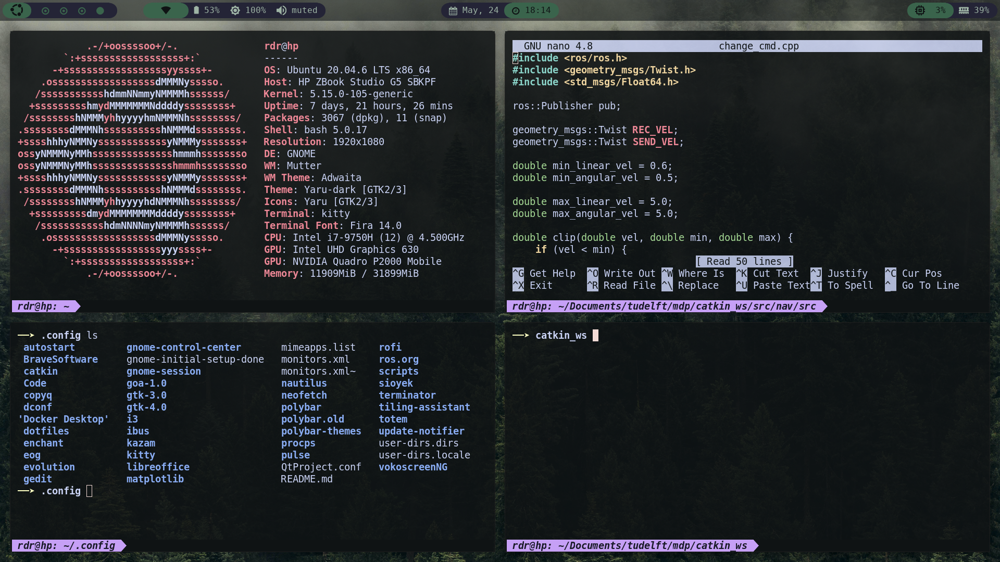
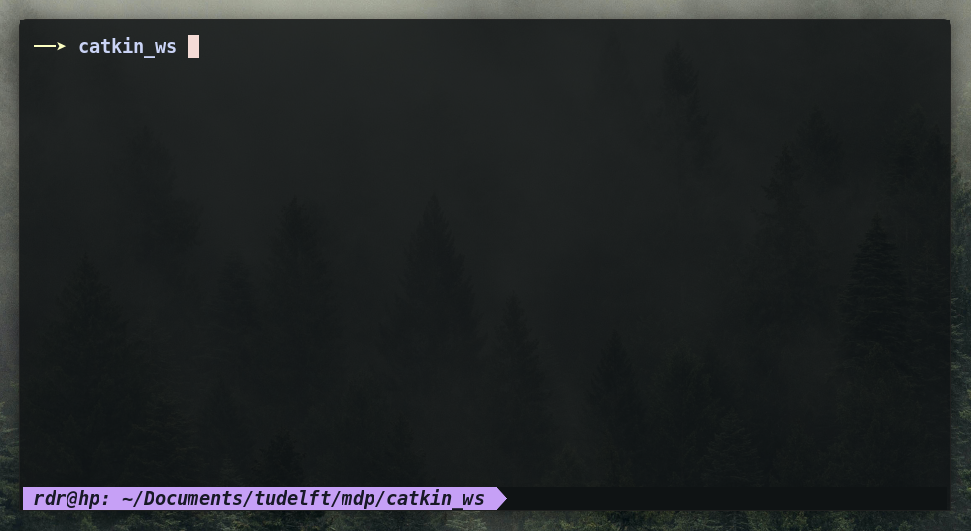
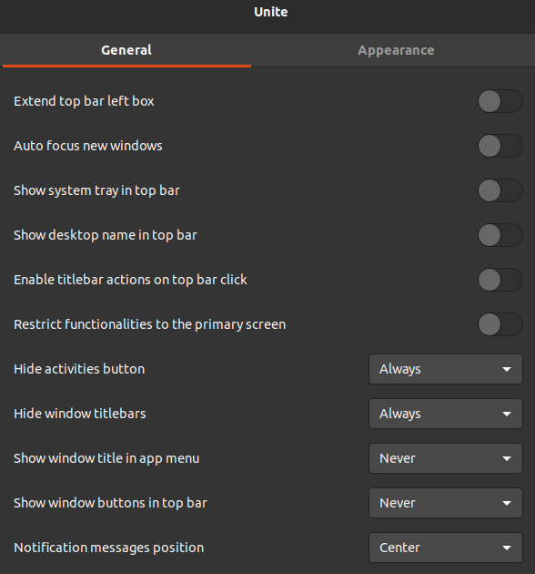
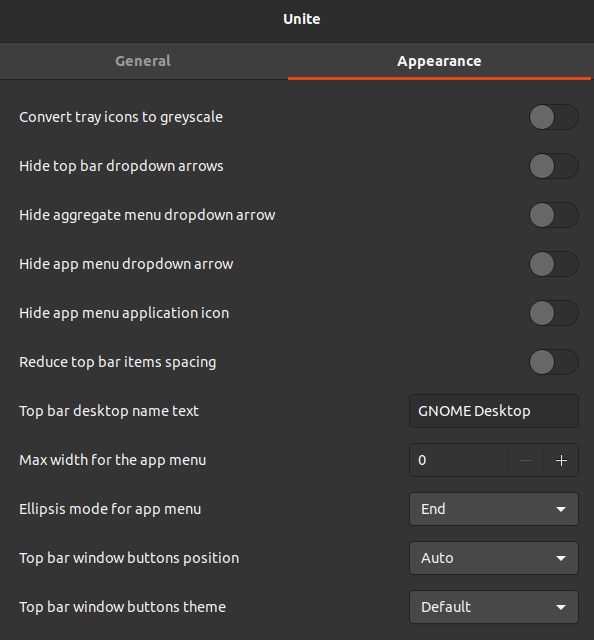
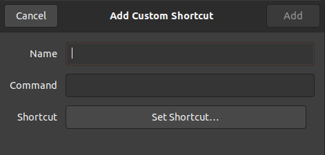

# My kitty config

My kitty configuration is largely based on the macchiato configuration from [this repo](https://github.com/catppuccin/kitty). But my repo will contain all the code that you need. Looking at this readme, you might be thinking: "Wow that is a lot of text". That's because I wanted to be thorough. But don't worry! It is actually very easy to do.

# Terminal breakdown

In the image above, you see 3 main elements:
- **Arrow** - The yellow arrow specifies the beginning of a line.
- **Current directory** - The `catkin_ws` displayed in bold is the current directory that you are in. So, it will not display the entire path.
- **Full path** - At the bottom in purple, you see the full path from home to your current directory, including your username and the name of your laptop. Note that if you have multiple tabs open (Ctrl + shift + t), the paths might get cutoff a little bit.

# Shortcuts
These are the shortcuts that I usually use. However, I believe that this terminal has the same shortcuts as other terminals.
- Add a tab: `Ctrl + shift + t`
- Switch between tabs: `Ctrl + shift + left-arrow-key` / `Ctrl + shift + right-arrow-key`
- Close a tab: `Ctrl + shift + q`

# Installation
### Installing Kitty terminal
Install the kitty terminal by typing the following command in your terminal.
```bash
sudo apt install kitty
```
You should now be able to open kitty, either by typing the command `kitty` in your terminal or by simply searching for the app.


### Configuring the kitty terminal
Enter the following commands in (any) terminal:
```bash
cd ~/.config
ls
```

If you see a folder called `kitty`, open it. If this folder does not exist yet, create it.
Inside the `~/.config/kitty` directory, insert the `kitty.conf` and the `colors.conf` files that you can find in this github repo (inside the folder named `kitty`). After you have done that, you will probably need to close your kitty terminal (if you have it open). After opening the kitty terminal again, it already should look a lot more like my terminal.

### Adding the arrow
My terminal starts with the yellow arrow and only shows your current directory at the top. If you want this, open your `~/.bashrc` file. Inside this file, you will likely see something like this, except your `PS1` variable will be different:
```bash
if [ "$color_prompt" = yes ]; then
    PS1="\[\e[38;2;253;255;194m\]──➤ \[\e[0m\]\[\e[1m\]\W\[\e[0m\] "
else
    PS1="\[\e[38;2;253;255;194m\]──➤ \[\e[0m\]\[\e[1m\]\W\[\e[0m\] "
```
Comment out your current `PS1` value and add the `PS1` definition that you see above. Note that instead of the arrow, add any unicode symbol (at least I believe so).

Note that you can also just add `PS1="\[\e[38;2;253;255;194m\]──➤ \[\e[0m\]\[\e[1m\]\W\[\e[0m\] "` near the end of your `~/.bashrc` script.

### Making sure you can use this terminal with the robot
By default, the kitty terminal uses the `xterm-kitty` terminal emulator. However, the mirte master does not recongize this terminal emulator, but uses export `xterm-256color` instead. So in order to be able to use the kitty terminal with your robot, add the following line at the end of your `~/.bashrc`:
```bash
export TERM=xterm-256color
```
This will (or at least should) not have any effects on the kitty terminal or any other terminal.

### Removing the top bar of the kitty terminal
Right now, you might be thinking: "Why do I have this ugly top bar on my kitty terminal? Ricardo's terminal has no top bar!". The reason for this is because I installed a gnome extension that removed the top bar on some apps. This gnome extension is called `unite`, which can be installed [here](https://extensions.gnome.org/extension/1287/unite/). If you are running Ubuntu 20.04 and have never installed a gnome extension before, you can find a tutorial [here](https://linuxconfig.org/how-to-install-gnome-shell-extensions-on-ubuntu-20-04-focal-fossa-linux-desktop). Installing gnome extensions on newer models of ubuntu is much easier.

PLEASE BE AWARE that this gnome extension is a blessing and a curse. The reason for this is that this app will remove the top bar of some apps, but not all. Top bars are often ugly, but they are usefull, since they allow you to drag the app across the screen and minimize and close the app. Without the top bar, you will not be able to do that anymore with some apps (i.e. vscode and kitty). Hence, make sure you ahave keybinding shortcuts to minimize, close, and move apps.

These are my settings for the unite extension. You can change the settings of the unite extension inside the `Tweaks` app. Note that I just changed the settings until the top bar was removed and honestly have no idea what all these settings are:




### Adding a keyboard shortcut to open kitty
Inside Ubuntu 20.04, you can create and edit keyboard shortcuts by opening your settings and heading to `Keyboard Shortcuts`. All the way at the bottom, you can add custom shortcuts. If you click the `+`-sign, you will see this screen pop up:



The name doesn't really matter, so you can name it whatever you want. However, you need to put the command to: `kitty`. Then you can set your shortcut. You can set the keybinding by pressing the `Set Shortcut...` button and then entering the keybindings that you want to use for this shortcut. HOWEVER, BE CAREFUL that you don't use an already-existing shortcut. If you want to use an already-existing shortcut, make sure you remove that shortcut first.

### eh voila
Now you should have exactly the same kitty terminal as I do!

### Personalizing your kitty terminal
You can customize your kitty terminal by changing the `kitty.conf` and `colors.conf`. If you want to change these files, just ask chatGPT. That's also what I did.

